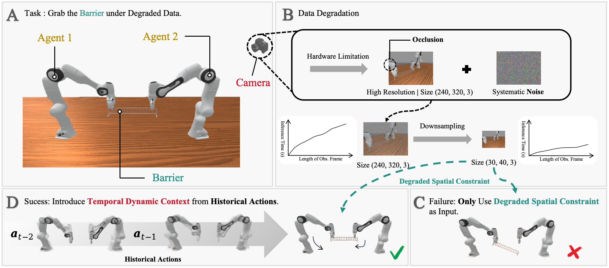

<div style="text-align: center;">
  <h1 class="is-1">CDP: Towards Robust Autoregressive Visuomotor Policy Learning via Causal Diffusion</h1>

  <a href="https://gaavama.github.io/CDP/"><strong>Project Page</strong></a>
  |
  <a href="https://arxiv.org/abs/2506.14769"><strong>arXiv</strong></a>
  
  Jiahua Ma*, 
  <a href="https://www.gu-zhang.com/">Yiran Qin*</a>, 
  Yixiong Li, 
  Xuanqi Liao, 
  Yulan Guo, 
  <a href="http://zhangruimao.site/">Ruimao Zhang</a>
</div>

<div align="center">
  
</div>

**Causal Diffusion Policy**: a transformer-based diffusion model that enhances action prediction by conditioning on historical action sequences. **(A)**: When performing the task of “grabbing the barrier” in practice, **(B)**: the quality of observations is degraded by factors such as sensor noise, occlusions, and hardware limitations. In fact, this degraded but high-dimensional observation data not only fails to provide sufficient spatial constraint information for policy planning but also slows down the planning speed. **(C)**: In this case, the robot is unable to perform accurate manipulation. **(D)**: In this paper, we address historical action sequences to introduce temporally rich context as a supplement, which enables more robust policy generation.
          

## 🛠️ Getting Started

### Installation

Please following [INSTALL.md](INSTALL.md) to set up the cdp conda environments along with their required dependencies.

### Data
Please refer to the [3D Diffusion Policy](https://github.com/YanjieZe/3D-Diffusion-Policy) repository to generate demonstrations.

### Training
1. To generate the demonstrations, run the appropriate `gen_demonstration_xxxxx.sh` script—check each script for specifics. For example:
    ```bash
    bash scripts/gen_demonstration_adroit.sh hammer
    ```
    This command collects demonstrations for the Adroit `hammer` task and automatically stores them in `Causal-Diffusion-Policy/data/` folder.

2. To train and evaluate a policy, run the following command:
    ```bash
    bash scripts/train_policy.sh dp2 adroit_hammer 0801 0 0
    bash scripts/train_policy.sh cdp2 adroit_hammer 0801 0 0
    bash scripts/train_policy.sh dp3 adroit_hammer 0801 0 0
    bash scripts/train_policy.sh cdp3 adroit_hammer 0801 0 0
    ```
    These commands train a DP2, CDP2, DP3, CDP3 policy on the Adroit `hammer` task, respectively.


# 😺 Acknowledgement
Our code is generally built upon 
[3D Diffusion Policy](https://github.com/YanjieZe/3D-Diffusion-Policy). 
We thank the authors for their nicely open sourced code and their great contributions to the community.
For any questions or research collaboration opportunities, please don't hesitate to reach out:
majiahua99@gmail.com
<!-- [Diffusion Policy](https://github.com/real-stanford/diffusion_policy), 
[DexMV](https://github.com/yzqin/dexmv-sim), 
[DexArt](https://github.com/Kami-code/dexart-release), 
[VRL3](https://github.com/microsoft/VRL3), 
[DAPG](https://github.com/aravindr93/hand_dapg), 
[DexDeform](https://github.com/sizhe-li/DexDeform), 
[RL3D](https://github.com/YanjieZe/rl3d), 
[GNFactor](https://github.com/YanjieZe/GNFactor), 
[H-InDex](https://github.com/YanjieZe/H-InDex), 
[MetaWorld](https://github.com/Farama-Foundation/Metaworld), 
[BEE](https://jity16.github.io/BEE/), 
[Bi-DexHands](https://github.com/PKU-MARL/DexterousHands), 
[HORA](https://github.com/HaozhiQi/hora).  -->

# 📝 Citation

If you find our work useful, please consider citing:
```
@article{ma2025cdp,
  title={CDP: Towards Robust Autoregressive Visuomotor Policy Learning via Causal Diffusion},
  author={Ma, Jiahua and Qin, Yiran and Li, Yixiong and Liao, Xuanqi and Guo, Yulan and Zhang, Ruimao},
  journal={arXiv preprint arXiv:2506.14769},
  year={2025}
}
```
